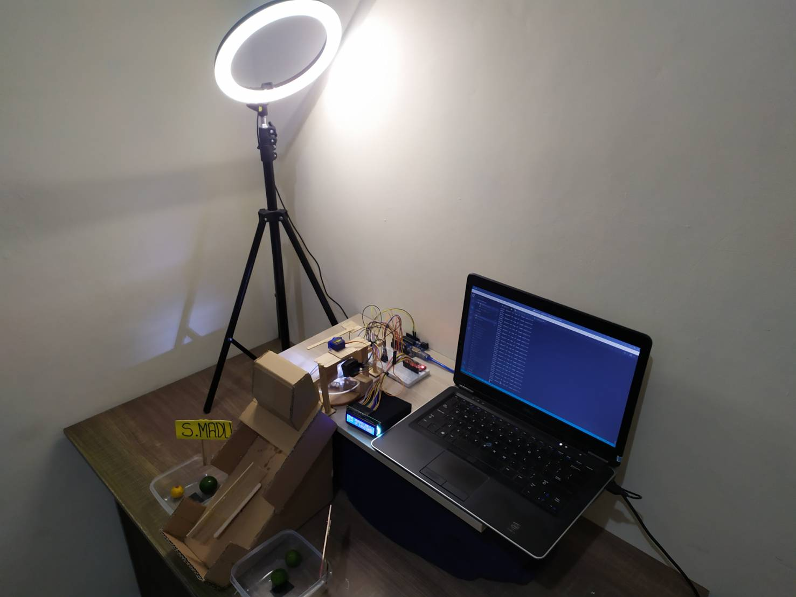
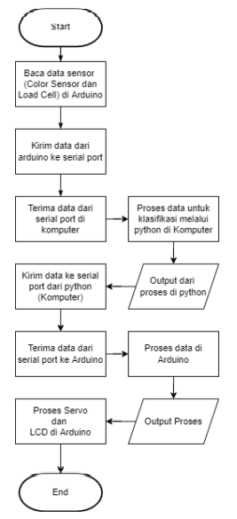

# Implementasi Pattern Recognition menggunakan K-Nearest Neighbor 
## Klasifikasi Jeruk Kunci dan Jeruk Santang Madu Berdasarkan Berat dan Warna menggunakan Metode KNN
Pada projek akhir ini kami melakukan Klasifikasi terhadap Jeruk Santang Madu dan Jeruk Kunci yang mana pada input warna terbagi menjadi tiga spektrum warna, yaitu Red, Green, dan Blue.


[DEMO VIDEO click here!](https://www.youtube.com/watch?v=p0su3leJ0DI)
### Flowchart


### Libraries used (python)
```
Pyserial
Sklearn
Pandas
Numpy
``` 
### Libraries used (arduino)
```
Servo.h
HX711.h (load cell)
LiquidCrystal_I2C.h (LCD)
``` 
### Dataset
```
Dokumentasi Pribadi Peneliti
``` 
